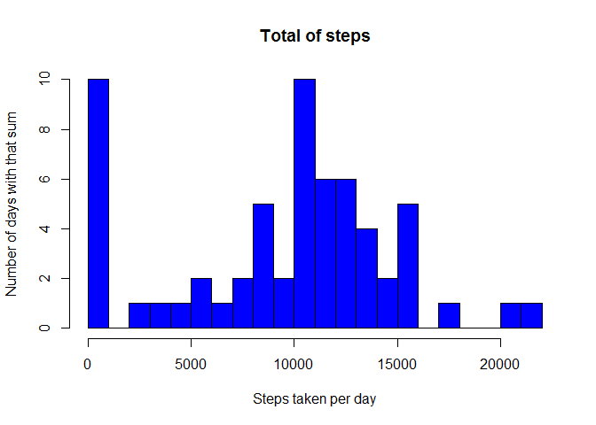
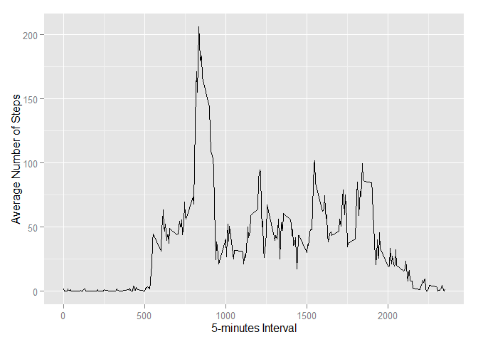
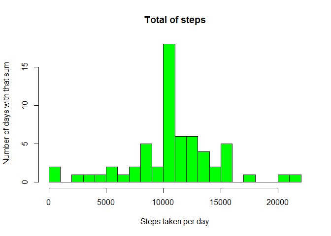

# Reproducible Research: Peer Assessment 1


## Loading and preprocessing the data

The first step is processing the CSV file. For making the code easier, we've already unzipped the file and we're only reading directly.


```r
options(warn=-1) # Used for removing fread warnings
# Step 1: Reading data
dados <- read.csv("activity.csv")

head(dados)
```

```
##   steps       date interval
## 1    NA 2012-10-01        0
## 2    NA 2012-10-01        5
## 3    NA 2012-10-01       10
## 4    NA 2012-10-01       15
## 5    NA 2012-10-01       20
## 6    NA 2012-10-01       25
```

## What is mean total number of steps taken per day?

For seeing this, we will firstly group using tapply function and then plotting
the result.


```r
passos <- tapply(dados$steps, dados$date, sum, na.rm = TRUE)
hist(as.numeric(passos), breaks=20, main="Total of steps", col="blue", 
     xlab="Steps taken per day", ylab = "Number of days with that sum")
```

 

We can calculate the mean and median using this:


```r
mean(passos, na.rm = TRUE)
```

```
## [1] 9354.23
```

```r
median(passos, na.rm = TRUE)
```

```
## [1] 10395
```


## What is the average daily activity pattern?

1. Make a time series plot (i.e. type = "l") of the 5-minute interval (x-axis) and the average number of steps taken, averaged across all days (y-axis).


```r
library(ggplot2)
media.intervalos <- aggregate(x = list(steps = dados$steps), by = list(interval = dados$interval), FUN = mean, na.rm = TRUE)
ggplot(data = media.intervalos, aes(x = interval, y = steps)) + geom_line() + xlab("5-minutes Interval") + ylab("Average Number of Steps")
```

 

2. Which 5-minute interval, on average across all the days in the dataset, contains the maximum number of steps?


```r
media.intervalos[which.max(media.intervalos[,2]),1]
```

```
## [1] 835
```

Based on the answer (835), and since the pattern for the interval is the hour of the day and then the minutes, we can say that 8:35 A.M. is the hour of day with most steps - which is reasonable to say, since it's when people are going to work.

## Imputing missing values

There are a number of days/intervals with missing values (coded as NA). The presence of missing days may introduce bias into some calculations or summaries of the data.

1. As asked, we calculated and reported the total number of missing values in the dataset (i.e. the total number of rows with NAs).


```r
missing.values <- is.na(dados$steps)
table(missing.values)
```

```
## missing.values
## FALSE  TRUE 
## 15264  2304
```

The second point is devising a strategy for filling in all of the missing values in the dataset. As suggested, we used the mean of that interval, creating a new dataset that is equal to the original dataset but with the missing data filled in.


```r
dados2 <- cbind(dados, media.intervalos[,2])
names(dados2)[4] <- c("mean")
# If it's NA, we fill in with the mean; else, the data itself.
dados2$steps <- ifelse( is.na(dados2$steps), dados2$mean, dados2$steps)
```

Finally, our goal is making a histogram of the total number of steps taken each day and calculating the mean and median total number of steps taken per day, similarly to the data . 


```r
passos2 <- tapply(dados2$steps, dados2$date, FUN = sum, na.rm = TRUE)
hist(as.numeric(passos2), breaks=20, main="Total of steps", col="green", 
     xlab="Steps taken per day", ylab = "Number of days with that sum")
```

 

Calculating the mean and median using this:


```r
mean(passos2, na.rm = TRUE)
```

```
## [1] 10766.19
```

```r
median(passos2, na.rm = TRUE)
```

```
## [1] 10766.19
```

We can see that the median is not that different from the previous one, but the average increases since we have more numbers that are fullfilled by some significant number.

## Are there differences in activity patterns between weekdays and weekends?


```r
library(ggplot2)
dados2$date <- strptime(dados2$date, "%Y-%m-%d")
dados2$day <- ifelse((weekdays(dados2$date) %in% c("sábado", "domingo")), "weekend", "weekday")

table(dados2$day)
```

```
## 
## weekday weekend 
##   12960    4608
```

```r
averages <- aggregate(steps ~ interval + day, data = dados2, mean)
p <- ggplot(averages, aes(interval, steps)) + geom_line()
p <- p + facet_grid(day~.) + xlab("5-minute Intervals") + ylab("Steps")
print(p)
```

 

